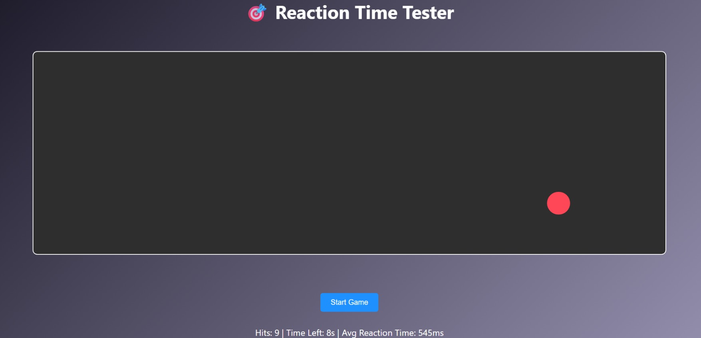

# 🎯 Reaction Time Tester – Target Click Game

A fast-paced game to test and improve your reaction speed! Click on randomly appearing targets before they disappear. At the end of the game, view your total hits and average reaction time.



---

## 🚀 Features

- 🕹️ Random target spawning in a bounded game area
- ⏱️ 30-second countdown timer
- 📈 Real-time stats: hits and average reaction time (ms)
- 🎨 Smooth UI animations and hover effects
- 🧠 Built with just HTML, CSS, and JavaScript — no libraries!

---

## 📂 Folder Structure

DayXX-Reaction-Time-Tester/
├── index.html
├── style.css
└── script.js

yaml
Copy
Edit

---

## 🎮 How to Play

1. Click the **Start Game** button.
2. Targets will appear randomly for **1 second each**.
3. Click the targets quickly before they disappear.
4. Track your:
   - ✅ Hits
   - 📊 Avg Reaction Time
   - ⌛ Time Left
5. When time is up, you'll get your final score via alert.

---

## 🧠 Concepts Used

- DOM Manipulation
- Randomized positioning
- setInterval / setTimeout
- Event handling
- Timing & performance tracking
- CSS transitions & responsive layout

---

## ✅ Demo

> You can deploy it easily via GitHub Pages or Netlify.  
> [Live Demo](https://yourusername.github.io/DayXX-Reaction-Time-Tester)

---

## 🛠️ Setup

1. Clone the repo  
   ```bash
   git clone https://github.com/yourusername/DayXX-Reaction-Time-Tester
   cd DayXX-Reaction-Time-Tester
Open index.html in your browser and start playing!